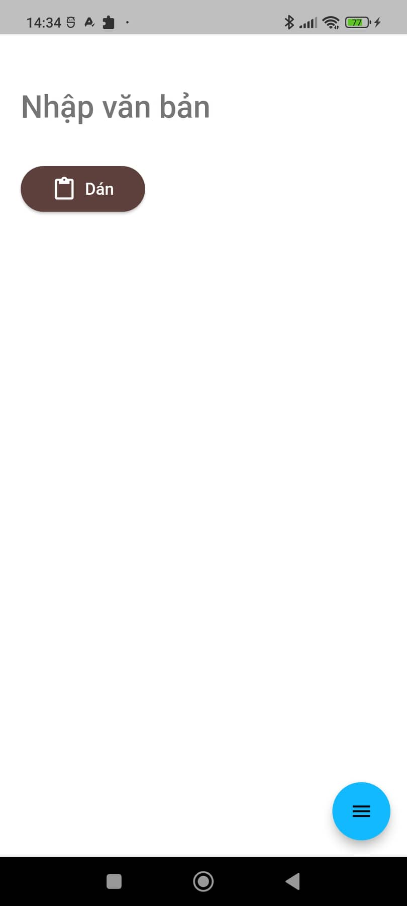
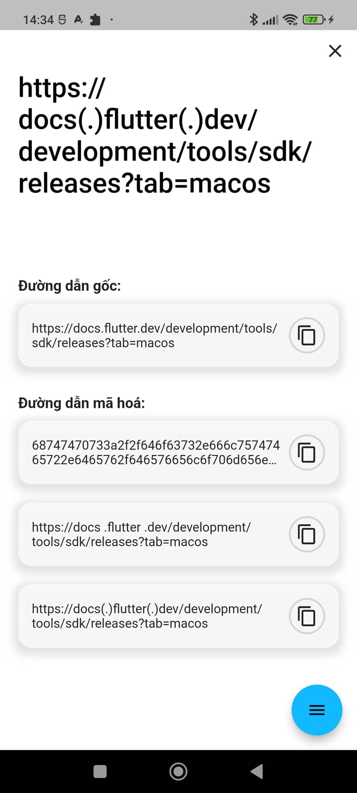
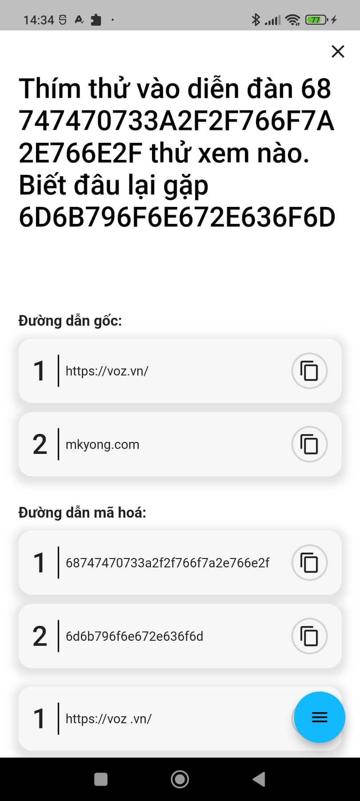
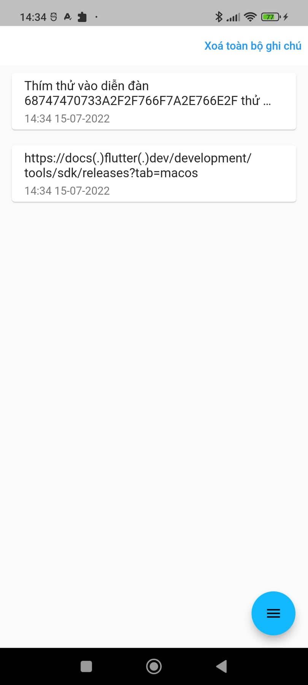

# Convert Link

[](https://github.com/Elias8/last_fm/actions/workflows/workflow.yml)
[![style: very good analysis][very_good_analysis_badge]][very_good_analysis_link]
[](https://flutter.dev/docs/development/tools/sdk/releases)
[![License: MIT][license_badge]][license_link]

The simple app gets the link or encodes the link on the comment.

---

## "Production level" implementations

- Router with [Go Router](https://gorouter.dev/)
- Linting style with [Effective Dart](https://dart.dev/guides/language/effective-dart)
- Dependency Injection with [injectable](https://pub.dev/packages/injectable) and [get_it](https://pub.dev/packages/get_it)
- Testing with [mockito](https://pub.dev/packages/mockito) and [bloc_test](https://pub.dev/packages/bloc_test)

## ScreenShots 📷

             |  
---------------------------------------------|--------------------------------------------------
     |  

## Installation

- Check if you are in the beta channel of flutter SDK and the version v2.17.0 or higher. [Instruction to change flutter channel](https://github.com/flutter/flutter/wiki/Flutter-build-release-channels#how-to-change-channels).
- Clone the repo

  ```sh
  git clone https://github.com/viviethoang99/convert_link.git
  ```

- And then we can use the normal build and run procedure

  ```sh
  flutter pub get
  flutter run
  ```

- Some files like `*.freezed.dart`, `*.g.dart`, `*.iconfig.dart` are auto generated. If there is any issue from these files just run this command to regenerate them.

  ```sh
  flutter pub run build_runner watch --delete-conflicting-outputs
  ```

## Getting Started 🚀

This project contains 3 flavors:

- development
- staging
- production

To run the desired flavor either use the launch configuration in VSCode/Android Studio or use the following commands:

```sh
# Development
$ flutter run --flavor development --target lib/main_development.dart

# Staging
$ flutter run --flavor staging --target lib/main_staging.dart

# Production
$ flutter run --flavor production --target lib/main_production.dart
```

_\*Convert Link works on iOS, Android, Web, and Windows._

---

## Running Tests 🧪

To run all unit and widget tests use the following command:

```sh
flutter test --coverage --test-randomize-ordering-seed random
```

To view the generated coverage report you can use [lcov](https://github.com/linux-test-project/lcov).

```sh
# Generate Coverage Report
$ genhtml coverage/lcov.info -o coverage/

# Open Coverage Report
$ open coverage/index.html
```


[coverage_badge]: coverage_badge.svg
[flutter_localizations_link]: https://api.flutter.dev/flutter/flutter_localizations/flutter_localizations-library.html
[internationalization_link]: https://flutter.dev/docs/development/accessibility-and-localization/internationalization
[license_badge]: https://img.shields.io/badge/license-MIT-blue.svg
[license_link]: https://opensource.org/licenses/MIT
[very_good_analysis_badge]: https://img.shields.io/badge/style-very_good_analysis-B22C89.svg
[very_good_analysis_link]: https://pub.dev/packages/very_good_analysis
[very_good_cli_link]: https://github.com/VeryGoodOpenSource/very_good_cli
